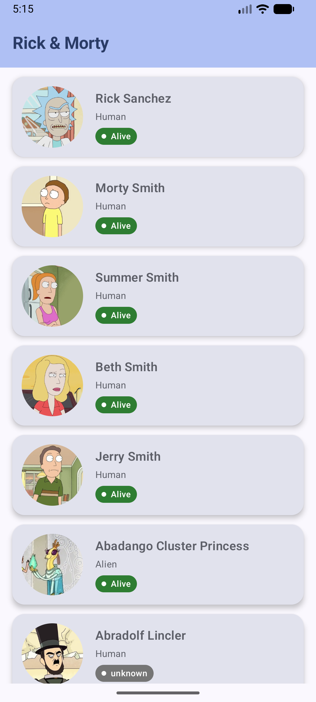
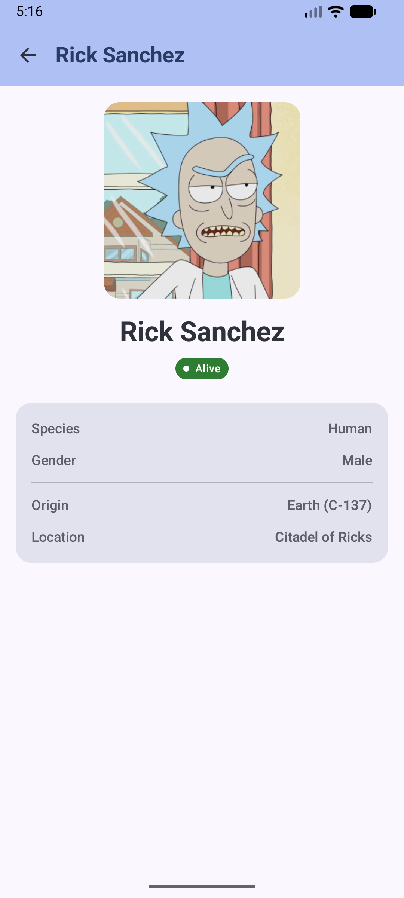

# Rick & Morty — Android App

Android application that consumes the [Rick and Morty API](https://rickandmortyapi.com/api) and displays a list of characters with navigation to a detail screen. The project demonstrates clean architecture, reactive state management and solid technical decisions in modern Kotlin.

---

## Screenshots

| Character List | Character Detail |
|---|---|
|  |  |

---

## Technologies

### Language
| Technology | Version | Justification |
|---|---|---|
| **Kotlin** | 2.2.x | Official Android language. Null safety, native coroutines, expressiveness and conciseness. |

### Architecture
| Pattern | Justification |
|---|---|
| **MVVM + Clean Architecture** | Clear separation of concerns across 3 layers (data, domain, presentation). Each layer can be tested in isolation. |
| **StateFlow** | Reactive state emitter, lifecycle-aware when combined with `collectAsStateWithLifecycle()`. Replaces `LiveData` while being fully idiomatic Kotlin. |
| **Sealed class UiState** | Represents mutually exclusive states (`Loading`, `Success`, `Error`). The compiler enforces exhaustive `when` expressions, eliminating impossible states. |
| **Use Cases** | Each use case has a single responsibility. They act as the correct extension point for future business logic (filtering, sorting) without touching the repository or ViewModel. |

### UI
| Technology | Version | Justification |
|---|---|---|
| **Jetpack Compose** | BOM 2026.02.01 | Google's modern declarative UI toolkit. Eliminates XML + View binding boilerplate and makes building reactive UI directly from state straightforward. |
| **Material 3** | (via BOM) | Google's updated design system with dynamic theming and accessible components. |
| **Navigation Compose** | 2.9.0 | Official navigation solution for Compose. Manages back stack, route arguments and screen return types in a type-safe manner. |

### Networking
| Technology | Version | Justification |
|---|---|---|
| **Retrofit 2** | 2.11.0 | Industry-standard library for consuming REST APIs on Android. Native support for `suspend fun` without additional adapters. |
| **OkHttp Logging Interceptor** | 4.12.0 | Allows inspecting requests/responses in Logcat during development. Can be excluded or reduced in production. |
| **Gson Converter** | 2.11.0 | Automatic JSON serialization/deserialization to DTOs with `@SerializedName` annotations. |

### Images
| Technology | Version | Justification |
|---|---|---|
| **Coil 3** | 3.2.0 | 100% Kotlin image loading library with native support for Coroutines and Compose (`AsyncImage`). Lighter than Glide/Picasso and better integrated with the Kotlin ecosystem. |

### Dependency Injection
| Technology | Version | Justification |
|---|---|---|
| **Koin** | 4.0.4 | DI framework with no annotation processing (no KSP/KAPT required), simplifying the build and reducing compile times. Its Kotlin DSL is readable and straightforward. The new `viewModelOf` in Koin 4.x handles `SavedStateHandle` automatically. |

### Testing
| Technology | Version | Justification |
|---|---|---|
| **MockK** | 1.14.0 | Idiomatic Kotlin mocking library. Supports `suspend fun` natively via `coEvery`/`coVerify`, unlike Mockito which requires additional adapters. |
| **kotlinx-coroutines-test** | 1.10.1 | Provides `runTest` to execute coroutine-based code synchronously in unit tests, with a virtual time scheduler for precise control. |

---

## Project Structure

```
com.luislenes.rickandmorty/
│
├── data/                               # Data layer
│   ├── remote/
│   │   ├── api/RickAndMortyApi.kt      # Retrofit interface
│   │   └── dto/                        # Network models (DTOs)
│   │       ├── CharacterDto.kt
│   │       ├── CharacterResponseDto.kt
│   │       └── LocationDto.kt
│   └── repository/
│       └── CharacterRepositoryImpl.kt  # Implementation + DTO → Domain mapping
│
├── model/                              # Domain layer
│   ├── Character.kt                    # Pure domain entity (no frameworks)
│   ├── repository/
│   │   └── CharacterRepository.kt      # Repository contract
│   └── usecase/
│       ├── GetCharactersUseCase.kt
│       └── GetCharacterByIdUseCase.kt
│
├── di/                                 # Dependency injection (Koin)
│   ├── NetworkModule.kt
│   ├── RepositoryModule.kt
│   ├── DomainModule.kt
│   └── ViewModelModule.kt
│
├── presentation/                       # Presentation layer
│   ├── CharactersUiState.kt
│   ├── CharacterViewModel.kt
│   ├── navigation/
│   │   ├── Screen.kt                   # Route definitions
│   │   └── AppNavGraph.kt              # Main NavHost + theme root
│   ├── ui/
│   │   ├── CharacterListScreen.kt      # List screen + state previews
│   │   ├── theme/
│   │   │   └── Color.kt               # Palette + StatusBadge color tokens
│   │   └── components/
│   │       ├── StatusBadge.kt          # Reusable composable
│   │       └── StatusBadgeColorProvider.kt  # Color logic isolated from UI
│   └── detail/
│       ├── CharacterDetailUiState.kt
│       ├── CharacterDetailViewModel.kt
│       └── CharacterDetailScreen.kt    # Detail screen + state previews
│
├── RickAndMortyApp.kt                  # Application with Koin bootstrap
│
└── res/values/
    ├── strings.xml                     # All user-visible strings
    └── dimens.xml                      # Semantic dimension tokens
```

### Test structure

```
src/test/
└── com.luislenes.rickandmorty/
    ├── data/repository/
    │   └── CharacterRepositoryImplTest.kt   # 11 tests: API calls + DTO mapper
    └── model/usecase/
        ├── GetCharactersUseCaseTest.kt       # 4 tests: delegation + result propagation
        └── GetCharacterByIdUseCaseTest.kt    # 4 tests: id routing + isolation
```

---

## Data Flow

```
API (Retrofit)
  └─▶ CharacterDto (data/dto)
        └─▶ CharacterRepositoryImpl.toDomain()
              └─▶ Character (domain entity)
                    └─▶ UseCase
                          └─▶ ViewModel (StateFlow<UiState>)
                                └─▶ Composable (collectAsStateWithLifecycle)
```

---

## Improvement Suggestions

### 1. Pagination with Paging 3
The API returns the first page (~20 characters). Integrating `androidx.paging:paging-compose` would enable infinite scroll with progressive loading, per-page state management and in-memory caching without manual offset logic.

### 2. Local cache with Room
Adding a Room database between the API and the repository, implementing an **offline-first** pattern: show cached data immediately and refresh in the background. This improves the offline experience and reduces repeated network calls.

### 3. Complete the test coverage
Data and domain layers are already covered with unit tests (19 tests). The remaining layers:
- **ViewModel**: test `CharacterViewModel` and `CharacterDetailViewModel` using a fake repository and asserting `StateFlow` state transitions (`Loading → Success`, `Loading → Error`).
- **UI (Compose)**: use `ComposeTestRule` to assert that each screen correctly renders its 3 `UiState` states — loading indicator, error message with retry button, and the populated list/detail.

### 4. Inject the CoroutineDispatcher into the ViewModel
Currently `viewModelScope` uses `Dispatchers.Main` internally. Injecting an explicit `CoroutineDispatcher` via Koin (`Dispatchers.IO` in production, `UnconfinedTestDispatcher` in tests) makes ViewModel tests fully deterministic and removes the dependency on Android's main looper.

### 5. More granular error handling
Currently any `Throwable` is caught and its `message` surfaced directly. Typing domain errors with a sealed class `AppError` (e.g., `NetworkError`, `TimeoutError`, `ServerError`) would allow the UI to show tailored messages per error kind and implement differentiated retry or fallback policies without changing the repository contract.

### 6. Filters and search
The API supports query params (`?name=`, `?status=`, `?species=`). Adding a search bar and filter chips in the list screen would be the next natural feature, reusing `CharacterRepository` with optional parameters and debouncing input with `Flow.debounce`.

### 7. Dark theme support
The app currently uses only a light color scheme. Defining a dark variant in `Theme.kt` and testing it with `@Preview(uiMode = UI_MODE_NIGHT_YES)` would cover a significant portion of users who use system dark mode.

### 8. ProGuard / R8 for production
Enable `isMinifyEnabled = true` in the `release` build type and add the necessary ProGuard rules for Gson, Retrofit and Koin to reduce APK size and obfuscate class names.

---

## AI-Assisted Development

This project was developed with the assistance of **GitHub Copilot** as a coding partner. AI collaboration covered the following areas:

| Area | AI contribution |
|---|---|
| **Boilerplate generation** | Generated repetitive but critical code: Koin modules, Retrofit interface, DTO data classes with `@SerializedName` annotations and the `toDomain()` mapper. |
| **Unit tests** | Wrote the full test suite for the data layer (`CharacterRepositoryImplTest`) and domain layer (`GetCharactersUseCaseTest`, `GetCharacterByIdUseCaseTest`), including edge cases like empty lists, exception propagation and call count verification with MockK. |
| **README authoring** | Drafted and iteratively updated this document, including technology justifications, data flow diagram, project structure tree and improvement suggestions. |

> All suggestions were reviewed, discussed and approved before being applied. The architecture decisions, naming conventions and technical criteria reflect the developer's judgment — AI acted as an accelerator, not a decision-maker.

